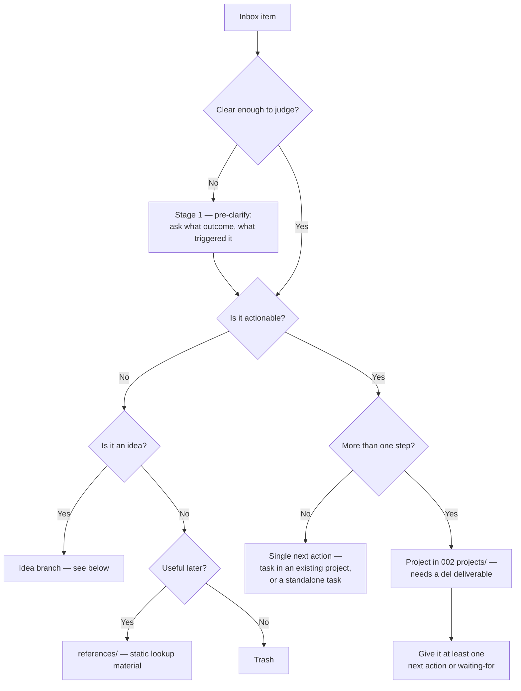

# Clarify Workflow

The decision algorithm for processing `001 inbox/`. `system/Data Model.md` describes *how the vault stores things*; this describes *how you decide what a captured thing is*. Run this during weekly review, or any time the inbox fills up.

Process items **one at a time, in order, and never put anything back in the inbox**. Every item leaves the inbox with a disposition.

## The pipeline

```
Stage 0  Capture          →  001 inbox/          no thinking, two doors
Stage 1  Pre-clarify      →  conversation        only for items too vague to judge
Stage 2  Clarify          →  the algorithm       actionable? multi-step? idea?
Stage 3  File & retire    →  project / ref / …   capture artifact is destroyed
```

### Stage 0 — Capture
Two doors, both write-only, no thinking required at capture time:

- **Phone → a capture app** (e.g. TaskForge) — writes one note per item into `001 inbox/`, with its own frontmatter (`status`, `priority`, `dateCreated`, `taskSourceType: taskNotes`).
- **Desktop / home-screen widget → `Main Inbox`** — one checkbox line per item.

Neither is storage. **Nothing in `001 inbox/` is ever a permanent home.** A capture app's frontmatter schema is deliberately *not* integrated with the rest of the vault — the `next-actions/` Tasks queries can't see it and don't need to, because a capture note never survives past stage 3. Tasks remain checkbox lines inside project notes (see `Data Model.md`); a capture-note format is a capture format, not a storage layer.

> **`001A inbox archive/` belongs to your capture app, not this workflow.** Notes land there if your capture app has its own "archive"/park action. It is personal scratch space — never swept, never processed, never written to by an agent. Ignore it entirely.

### Stage 1 — Pre-clarification
**Gate: can you even tell whether this item is actionable?** If not, it can't enter the algorithm yet.

Vague captures are normal and fine — the whole point of capture is that it's cheap. A one-word note carries intent that existed at capture time and has since evaporated. Pre-clarification recovers it.

This is a **conversation, not a filing step**. The questions:
- What outcome did you want when you wrote this?
- What triggered the capture — a conversation, a bill, an outage, an ad?
- Is this actually yours to do?

Output: the item rewritten with enough context that stage 2 can run on it. Then continue straight into stage 2.

**This is the only stage where an item may legitimately remain in the inbox.** If you genuinely haven't decided yet, it stays and gets re-asked at the next review.

Sharp edge worth remembering: *"I need information from someone else"* is **not** stuck. That's already actionable — the next action is "ask them." Only *"I haven't decided"* survives stage 1.

### Stage 3 — File and retire the capture
Once the item has a disposition, destroy the capture artifact so the inbox actually empties:

- **`Main Inbox` line** → strike through and append a pointer to where it landed (`~~item~~ → [[Project]]`). Keeps the audit trail visible in the note you actually look at.
- **Capture-app note** → **delete it.** The real record now lives in the project; keeping the capture note would be a second, invisible copy with a schema nothing queries.

## Stage 2 — the algorithm



## The idea branch

**An idea is not an inbox item you can file directly.** An idea is raw thinking — a framing, a hunch, a "what if we…". It has no deliverable and no next action yet, so it fails the actionable test, but it's too valuable to trash and too unformed to be reference material.

Every idea resolves one of exactly two ways:

1. **Clarify it into an actionable project** — if you can state a deliverable (`del`) and a first next action right now, promote it to `002 projects/`. Do this when the idea is already something you intend to make happen.
2. **Save it as a brainstorm idea** — if you can't state a deliverable yet, write it up in `references/Brainstorm Ideas/` with the thinking preserved verbatim, and drop a `#task-category/someday` stub in the relevant idea-inbox project pointing back at it.

**Never leave an idea sitting in `001 inbox/`.** An unclarified idea in the inbox is the single most common way this system silently stops working — it makes the inbox feel unprocessable, so you stop processing it.

Brainstorm ideas are reviewed on the same cadence as `004 someday-maybe/`: during weekly review, ask whether any of them have become clarifiable into a project yet. Ones that never do are eventually deleted — that's a healthy outcome, not a failure.

### Brainstorm idea vs. reference
- **`references/Brainstorm Ideas/`** — *your* unformed thinking. Under active reconsideration. Reviewed for promotion.
- **`references/` (elsewhere)** — settled lookup material (specs, memos, how-tos, external docs). Not part of the GTD workflow; never reviewed for promotion.

## Rules the algorithm enforces

These are the invariants a healthy vault satisfies. Check them during review:

1. **Every project has a `del`.** A project with no deliverable is not a project — it's an idea that got filed too early. Send it back through the idea branch. `del` stays a one-line summary; the project note's `## Scope` section is where that deliverable gets actually detailed and kept current as the project's real boundaries become clearer (what's in, what's out, what changed since the project started) — see `Data Model.md`.
2. **Every project has at least one open next action, or at least one waiting-for.** A project with neither is stuck by definition. See `next-actions/Stuck Projects.md`. Fix it by adding an action, or archive the project.
3. **Tasks and next actions are the same thing.** There is no separate "someday task" tier inside an active project other than the `#task-category/someday` tag.
4. **Every project carries a `project/...` category tag** from `999 config/Project Categories.md`, and a `value/...` tag under `## Why` when the motivating value is obvious.
5. **Challenge any project without a clear actionable deliverable.** "Learn more about X", "think about Y", "keep an eye on Z" are not deliverables. Either state what finished looks like, or demote it to a brainstorm idea / someday item.

## Where things end up

| Disposition | Location |
|---|---|
| Multi-step commitment | `002 projects/` (with `del` + ≥1 next action) |
| Single next action | Checkbox task inside the relevant project |
| Idea, clarifiable now | Promote to `002 projects/` |
| Idea, not clarifiable yet | `references/Brainstorm Ideas/` + `#task-category/someday` stub |
| Deferred commitment | `004 someday-maybe/` |
| Slow-burn personal item (in progress, no deadline, wants periodic nudges) | Standalone task in Main Inbox (or inside a project if one exists) + `#task-category/slow-burn` |
| Static lookup material | `references/` |
| Purchase to make | `005 Compritas/` |
| Nothing | Trash |

**Slow-burn vs. someday-maybe:** someday-maybe hasn't started and carries no commitment yet; slow-burn is already underway (e.g. "reading a specific book, a little at a time") with no real deadline, just a standing want for the agent to surface it now and then instead of letting it go silent. See `#task-category/slow-burn` in `next-actions/Slow Burn.md`.

---
*See also: [[Data Model]] · [[Quick Start]]*
