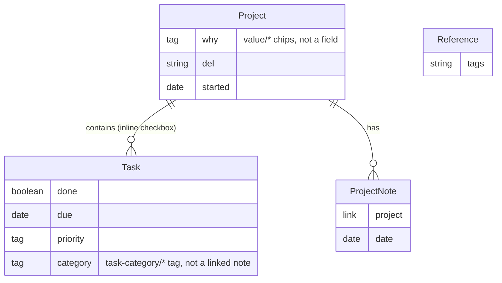

# GTD Vault Data Model

**Beta** — single-user only. Multi-user/team collaboration (owner/assignee tagging, shared-vault conflict handling) is planned for a future version; see Feature requests below.

How this vault is structured as a database. Most **tables** below are note types: a folder of notes sharing a frontmatter schema, where each **row** is one note and each **relationship** is a frontmatter field holding a wikilink to a note in another table (a foreign key). [Bases](https://help.obsidian.md/bases) queries (`.base` files) are the views/joins over those tables.

**Companion docs:** this file covers *storage* — what tables exist and how they relate. `system/Clarify Workflow.md` covers *process* — the decision algorithm for emptying `001 inbox/`, including the idea branch (an idea is either clarified into an actionable project or saved as a brainstorm idea in `references/Brainstorm Ideas/` — it never stays in the inbox) and the invariants every project must satisfy. `system/GTD Agent Directive.md` covers *agent behavior* — how an AI agent doing housekeeping in this vault should operate (one item at a time, when to ask vs. act, the project-quality audit). Bootstrap a new agent session from that file.

**Folder roles:** `system/` (templates, scripts, this doc) implements the mechanics — **not** dot-prefixed. A dot-prefixed `.system/` was tried and reverted: Obsidian excludes dot-folders from the vault's file API entirely (not just hidden from the UI, unreachable by Templater/Buttons), which broke every template. If you want it visually out of the way without breaking plugin access, use Settings → Files & Links → Excluded files (hides from search/quick-switcher only, not the file explorer, and doesn't affect plugin file access) — not set up by default. `999 config/` is the opposite of `system/`: controlled lists you're expected to edit directly (e.g. `Project Categories.md`, `Values.md`) to extend the vault's vocabulary — ships empty, fill in your own. `next-actions/` is the read-only *views* layer — browse it, don't edit the queries unless you're changing what a view shows.

**Categorization prefers folder structure over labels where possible.** A folder is legible with zero plugins — in Finder, in git, in any Markdown tool — while a frontmatter link or tag only renders as a relationship inside Obsidian. So category-type relationships (Project → category) are folder paths, not fields; only relationships that need cross-cutting metadata beyond a name (or that don't have a file to put in a folder, like Tasks) fall back to a link or tag.

**Tasks are the exception.** A Task row is a Markdown checkbox line (`- [ ] ...`) living inside its parent Project note's body — not its own note. The [Tasks plugin](https://github.com/obsidian-tasks-group/obsidian-tasks) parses checkbox lines across the whole vault (with metadata like due dates, priority, tags) into a queryable table without a file per row. [Tasks query blocks](https://publish.obsidian.md/tasks/) are the views for this table — the "frontend." [Dataview](https://github.com/blacksmithgu/obsidian-dataview) is available for any dashboard view that needs to join across note-based tables too (e.g. Projects + their Task counts).

**Plugin stack:** Bases (native) for note-based tables, Tasks for the inline Task table, Dataview for cross-file list/table queries, [Templater](https://github.com/SilentVoid13/Templater) for auto-filled frontmatter and scripted note creation, [Buttons](https://github.com/shabegom/buttons) as the clickable trigger for Templater actions inside a note.

## Entity Relationship Diagram



## Tables

### Projects
- **Folder:** `002 projects/` — the only project folder; a `project/someday` category tag covers someday/maybe instead of a separate folder.
- **Frontmatter:**
  - `del` — text, deliverable / definition of done
  - `started` — date, auto-filled to the note's creation date by Templater (`tp.file.creation_date()`) — no manual entry needed
  - `recaptured` — list of dates, one per time this same item was written into the inbox *again* after already existing somewhere in the vault. Empty/absent for most projects. Maintained by the agent during inbox processing, not by hand — see `GTD Agent Directive.md`. **Signal, not bookkeeping:** re-capturing something usually means you want it pushed, so a project with 3 recapture dates is one worth moving regardless of what its due dates say. Surfaced by `next-actions/Most Recaptured.md`. The count is `length(recaptured)` — there is deliberately no separate counter field to drift out of sync with the dates.
  - `tags` — holds the category tag (`project/...`), any active value tags (`value/...`, see Why below), and optionally `focus/daily` (see below)
  - `focus/daily` — a tag (not a field) you apply yourself to mark a project that deserves attention every day regardless of due dates or how it'd otherwise rank. Surfaced by `next-actions/Daily Focus.md` and always included in the daily-check shortlist per `GTD Agent Directive.md`. The agent doesn't decide which projects get this tag; it only reads and respects it.
- **Template:** `system/templates/Project Template.md`, registered in Templater's Folder Templates as the default for `002 projects/`, so `started` fills itself in the moment a new project note is created there.
- **Discriminator:** no `type` field — Projects are identified by folder path (`002 projects/`), not frontmatter.
- **Priority prefix (optional convention):** project filenames can be prefixed with a 3-digit number, e.g. `001 Website Redesign.md`, so you can eyeball rough priority order directly in Obsidian's file explorer. No hard rules on the numbering, it's a quick, ambiguous-on-purpose call, not a strict ranking — re-number loosely whenever priorities shift. Parallel/equal-priority projects share a number with a letter suffix (`016A`, `016B`, `016C`). Because the rename changes the filename but not the note's title, **give a renamed project an `aliases:` frontmatter field holding its original title** (e.g. `aliases: ["Website Redesign"]`), so any existing `[[Website Redesign]]` wikilink across the vault keeps resolving without needing to be rewritten. A fresh project doesn't need a number until you deliberately prioritize it — it's just its plain title until then. (See also `next-actions/Priority Order.md` for a numeric `priority:` field alternative that doesn't touch filenames at all — use whichever convention fits how you actually scan the vault.)
- **Body (most-actionable-first):** `📦 Archive project` button → `## Why` (value chips) → `## Tasks` (the checkbox list — what you actually act on, so it comes first) → `## Context` (why this project exists, what it's split from/feeds into — set once, rarely touched) → `## Scope` (the live, detailed version of `del` — what's actually in/out of the deliverable, updated in place as the real boundaries firm up, *not* a growing log) → `## Reference` (static facts: addresses, contacts, catalogue links, base IDs) → `## Note` (linked Project Notes, see below — this is also where the decisions log lives, as one ongoing linked note per project, not inline text).
  - **Decisions log lives in `project-notes/`, not the project note.** One ongoing Project Note per project (e.g. `project-notes/<Project Title> — Decisions Log.md`, `project:` frontmatter linking back), appended to over time. It surfaces automatically in the project's `## Note` section via the existing dataview list — no separate section or script needed, since a decisions log is just a Project Note like any other.
- **Relationships:** contains many Tasks (inline, not FK), has many Project Notes.
- **Archiving:** the `📦 Archive project (done)` button (static, `type line(+1) template` + `action Archive Project`, same no-embedded-expression pattern as everything else) runs `system/scripts/archiveProject.js` via a one-line wrapper template. The script tags the project `status/done` and moves it out of `002 projects/` into `005 archive/` via `app.fileManager.renameFile` — one click instead of dragging. Because it's a real move, the project drops out of every `002 projects`-scoped view (Folder Templates, `next-actions/All Projects`) automatically; `next-actions/Archived Projects.md` is the view for `005 archive/` instead.
- **Why:** no longer a free-text field — `## Why` renders clickable chips (`system/views/valueChips.js`, loaded via `dv.view()`) sourced from the controlled list at `999 config/Values.md`. Clicking a chip toggles a `value/<slug>` tag on the project via `app.fileManager.processFrontMatter` — multi-select, no plugin, and the option list is edited in one place (`999 config/Values.md`) rather than typed per-project. Adding a brand-new value means editing that list first; there's no inline "add new" from the chip UI by design.
  - **`dv.view()` scripts are not Node modules** — no `module.exports`, no function wrapper. The file's top-level code runs directly with `dv`/`input`/`app` already in scope, same as an inline `dataviewjs` block. First version of this script wrongly used the *Templater* user-script convention (`module.exports = function(tp) {...}`, correct for `system/scripts/addTask.js`, which is a different plugin with a different convention) — that defined a function and exported it without ever calling it, so it silently did nothing with no error.
  - **Lives in `system/views/`, not `system/scripts/`** — Templater's "Script files folder location" setting (`system/scripts`) scans *every* `.js` file there and tries to load it as a `tp.user.*` function; once `valueChips.js` stopped using `module.exports` (correctly, per Dataview's convention), Templater started erroring trying to load it as its own kind of script. The two plugins' script-loading conventions can't share a folder, so Dataview-view scripts get their own folder instead. Also same dot-folder restriction as everything else: `dv.view()` can't read from a path starting with `.`.
  - **`dv.current()` doesn't work inside a `dv.view()`-loaded script** — it throws `Cannot read properties of undefined`, since "which file is this" doesn't automatically carry over into the loaded file's context (same class of problem as Templater's `active_file` earlier). Fix: the calling `dataviewjs` block passes it explicitly — `await dv.view("system/views/valueChips", { file: dv.current().file })` — and the script reads `input.file` instead of calling `dv.current()` itself.
- **Category:** a `tags` property using a hierarchical tag, e.g. `project/work`, `project/home`, `project/someday` (mirrors the `task-category/...` convention already used on Tasks). The valid names are a controlled list at `999 config/Project Categories.md` — add a line there before using a new `project/...` tag. Tags rather than folders here, because a project can only live in one folder but might reasonably belong to more than one category-ish grouping.
- **Dropped for now:** `status` was cut to keep the template minimal (someday/maybe is now the `project/someday` category tag instead of a field or a folder).
- **Customization footer:** the template ends with a small `[[Values]] · [[Project Categories]]` link so it's obvious where to go to extend either controlled list, without cluttering the note itself.

### Tasks
- **Storage:** not a note. A checkbox line in the body of its parent Project note, under a `## Tasks` heading.
- **Syntax (Tasks plugin emoji format):**
  ```
  - [ ] Call vendor about quote 📅 2026-07-15 🔼 #task-category/waiting-for
  ```
  - ` - [ ] ` / `- [x]` — done status (row's primary key is implicit: file + line)
  - `📅 YYYY-MM-DD` — due date
  - `⏳` scheduled, `🛫` start date — optional, same date syntax
  - `🔺/⏫/🔼/🔽/⏬` — priority (highest → lowest), optional
  - `#task-category/...` — category, as a tag (see below), optional
- **Relationship to Project:** implicit — the task belongs to whatever Project note it's physically written in. No FK field needed.
- **Not to be confused with TaskForge/TaskNotes capture notes.** A phone capture app (e.g. TaskForge on Android) may write one *note* per item into `001 inbox/` with its own frontmatter (`status`, `priority`, `dateCreated`, `taskSourceType: taskNotes`). That is a **capture format, not a storage layer** — those notes are transient and are deleted once clarified into a project (see `Clarify Workflow.md`, stage 3). The Tasks-plugin queries in `next-actions/` deliberately do not read that schema. If you ever see TaskNotes frontmatter outside `001 inbox/`, something skipped the clarify step.
- **Category:** modeled as a **tag taxonomy**, not a linked table — `#task-category/waiting-for`, `#task-category/calls`, etc. Tags rather than folders here because a task doesn't live in its own file to put in a folder — it's a line inside a Project note, so a tag is the only lightweight option. If categories ever need their own metadata (a description, a review cadence), promote this to a real linked table.
- **Adding a task:** the `➕ Add task` button in each project's `## Tasks` section (Buttons plugin) runs `system/templates/Add Task.md`, a Templater template that calls the `addTask` user script (`system/scripts/addTask.js`). The script prompts for the task text, then a picker for its type/context, and returns the finished checkbox line with the right `#task-category/...` tag. Ships with five contexts: Calls, Errands, Computer, Waiting For, Someday — a deliberately small starting set. **Extending it:** adding your own context (e.g. a physical-work context, a slow-burn/no-deadline context) is a three-file change: the `labels`/`values` arrays in the script, a new `next-actions/<Name>.md` view, and an exclusion line in `next-actions/No Context.md` (miss that last one and every task with the new tag also shows up as untagged).
  - Picking "Waiting For" adds a follow-up prompt ("waiting on who/what") stored as a Dataview inline field, e.g. `[waitingOn:: vendor]`.
- **In-project "waiting" indicator:** a `tasks` query block right above the checkbox list, scoped to the current file via the Tasks plugin's `{{query.file.path}}` placeholder and filtered to `#task-category/waiting-for`. If the project has an open waiting-for task, it surfaces right there — no separate status field to keep in sync.
- **Views:** [Tasks query blocks](https://publish.obsidian.md/tasks/) (` ```tasks ` code blocks), e.g. all not-done tasks vault-wide, sorted by due date, grouped by filename (= grouped by Project); see the [next-actions/](../next-actions/Next%20Actions.md) folder for the vault-wide views — one single-purpose note per view (all open tasks, due/overdue, waiting for, and one per context) rather than one crowded dashboard.

### Project Notes
- **Folder:** `project-notes/` (auto-created on first use — see below)
- **Frontmatter:**
  - `project` — link → Projects (n:1)
  - `date`
- **Purpose:** timestamped log/update entries for a project (meeting notes, status updates), kept separate from the project note itself so the project note stays a clean summary. **Also where a project's decisions log lives:** one ongoing Project Note per project, appended to over time, rather than a growing inline section in the project note — same file, same dataview listing, just a different note that happens to get appended to instead of created fresh each time.
- **Relationships:** belongs to one Project.
- **Creating one:** the `🗒️ New linked note` button in a project's `## Note` section (Buttons plugin, `type line(+1) template` + `action New Project Note` — fully static, no embedded Templater expression in the button itself) runs `system/templates/New Project Note.md`, a one-line template that calls the `createProjectNote` user script (`system/scripts/createProjectNote.js`). The script reads `tp.file.title` (reliable here — the button is just inserting the script's output into the currently-open note, so there's no "which file is this" ambiguity), builds `project-notes/<project title> — <timestamp>.md`, creates the file directly via `app.vault.create(...)` with `project`/`date` frontmatter, and opens it in a split pane via `app.workspace.getLeaf("split")`.
- **Why not `tp.config.active_file`, or a dynamic value inside the button:** both were tried and both failed. `tp.config.active_file` (Templater's reference to "whatever note was open when the template was invoked") resolves to the *template* file, not the project, when invoked through Buttons — it doesn't preserve that context the way Templater's own commands do. The next attempt embedded a Templater expression directly in the button (`type note(project-notes/<% ... %>, split) template` + `templater true`), relying on Buttons to convert the expression to a value on click and back on completion — but that "convert back" step is unreliable, and once it silently got stuck it froze the wrong value into the *master template*, corrupting every new project created afterward. Moving all the dynamic logic into a script and keeping the button 100% static removes the failure mode instead of working around it — same pattern `system/scripts/addTask.js` already uses.
- **Displaying them on the project:** a plain Dataview query in the same `## Note` section (`FROM "project-notes" WHERE contains(project, this.file.link)`) lists every Project Note linked back to the current project — no card styling, just a list.

### References
- **Folder:** `references/` (existing)
- **Frontmatter:** `type: reference`, `tags` (optional)
- **Relationships:** none formal — linked ad hoc via wikilinks from Project/Task bodies as needed. "Static" = not part of the GTD workflow (not reviewed/processed), just lookup material.

## Setup checklist (one-time, in Obsidian settings)
Templater is installed and enabled, but its settings need pointing at the files this build added:
1. **Settings → Templater → Template folder location** → `system/templates`
2. **Settings → Templater → Script files folder location** → `system/scripts` (this is what makes `tp.user.addTask` resolve to `system/scripts/addTask.js`)
3. **Settings → Templater → Folder Templates** → add `002 projects` → `system/templates/Project Template.md`
4. **Settings → Templater → Trigger Templater on new file creation** → on (this is what makes the folder template — and `started`'s auto-fill — actually apply when you create a new project note, e.g. via the file explorer's "New note" in that folder)
5. ~~Settings → Templates (core plugin) → Template folder location → `system/templates`~~ — **don't do this.** Setting both plugins' folder to the same path causes Buttons to find the template twice ("Found template in both Core Templates and Templater folders"), which triggers a duplicate-creation race and a bad note (falls back to Obsidian's generic "Untitled N" filename instead of the real one). Leave the core Templates plugin's folder location **blank** — only Templater's setting from step 1 should point at `system/templates`.

**Buttons syntax, verified against the plugin's own README:**
- Buttons has no `template` or `folder` key. A template is referenced by **note title** (no path, no extension) in an `action` field, e.g. `action New Project Note` finds `system/templates/New Project Note.md` via the templates-folder setting above.
- "New linked note" uses `type line(+1) template` + `action New Project Note` — same static, no-embedded-expression pattern as "Add task" below, after the dynamic-value-in-button approach proved unreliable (see the Project Notes section above).
- "Add task" uses `type line(+1) template` + `action Add Task` — inserts the template's output one line below the button itself, which is portable (works regardless of where the button sits in the file) rather than pinned to an absolute line number.

## Open decisions
- **Project Notes** — modeled as a global `project-notes/` folder (each note FK's back to its project) rather than nested subfolders per project, so a single Base can list/filter all of them across projects. Nest them under each project folder instead if you'd rather (consistent with the folder-over-label preference above).

## Maintenance policy
Bug fixes update `system/scripts/*.js` and `system/templates/*.md` only — **existing notes are never patched retroactively**. A fix protects every note created *after* it lands; notes created before keep whatever was baked into them at creation time (this only affects embedded call-site content like button/dataviewjs block text — the underlying data model, i.e. frontmatter/tags/folder/checkbox lines, is unaffected and stays fully queryable regardless). Accepted tradeoff, not an oversight.

## Feature requests (not building yet)
- **Multi-user: owner/assignee on Projects and Tasks** — deferred. If you set up a sync layer for a shared vault, exclude `.obsidian/workspace.json` from sync to avoid conflict-file spam. No owner/assignee tagging yet — vault is currently one shared pool, no per-person view.
